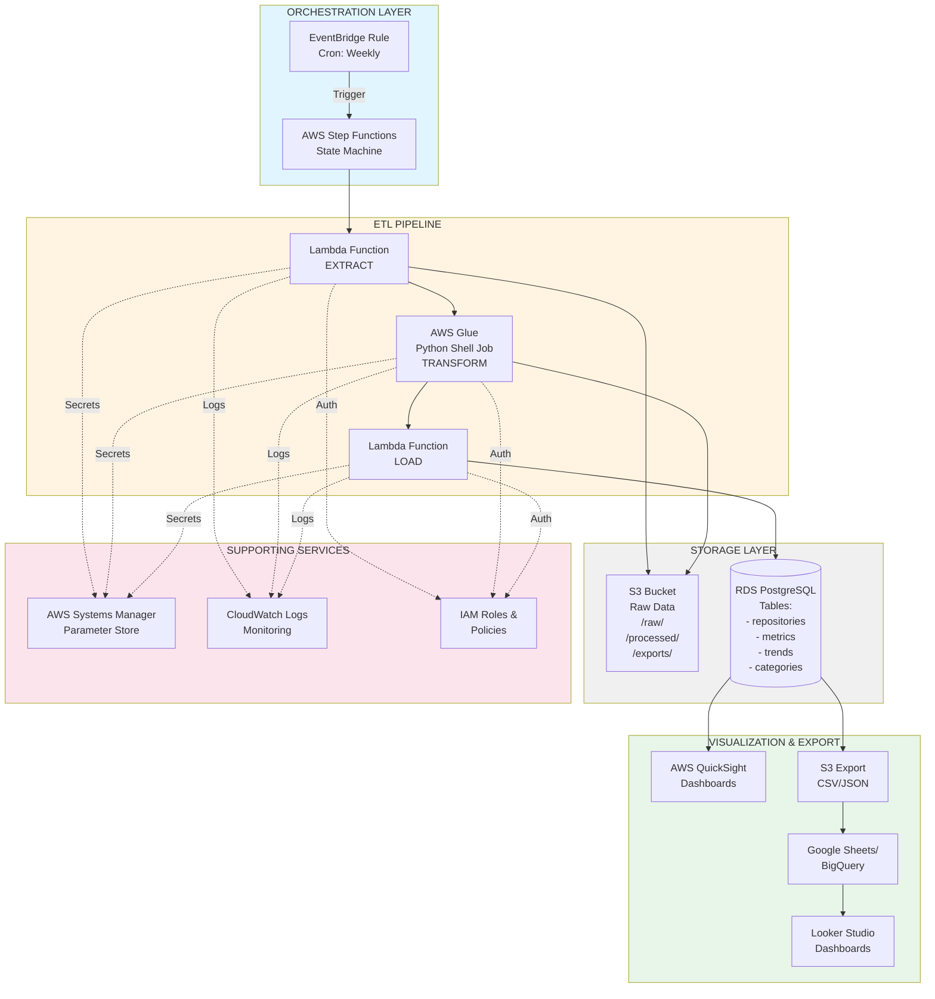

```mermaid
graph TB
    subgraph Orchestration["ORCHESTRATION LAYER"]
        EB[EventBridge Rule<br/>Cron: Weekly]
        SF[AWS Step Functions<br/>State Machine]
        EB -->|Trigger| SF
    end
    
    subgraph ETL["ETL PIPELINE"]
        Extract[Lambda Function<br/>EXTRACT]
        Transform[AWS Glue<br/>Python Shell Job<br/>TRANSFORM]
        Load[Lambda Function<br/>LOAD]
        
        SF --> Extract
        Extract --> Transform
        Transform --> Load
    end
    
    subgraph Storage["STORAGE LAYER"]
        S3[S3 Bucket<br/>Raw Data<br/>/raw/<br/>/processed/<br/>/exports/]
        RDS[(RDS PostgreSQL<br/>Tables:<br/>- repositories<br/>- metrics<br/>- trends<br/>- categories)]
        
        Extract --> S3
        Transform --> S3
        Load --> RDS
    end
    
    subgraph Visualization["VISUALIZATION & EXPORT"]
        QS[AWS QuickSight<br/>Dashboards]
        Export[S3 Export<br/>CSV/JSON]
        GCP[Google Sheets/<br/>BigQuery]
        Looker[Looker Studio<br/>Dashboards]
        
        RDS --> QS
        RDS --> Export
        Export --> GCP
        GCP --> Looker
    end
    
    subgraph Support["SUPPORTING SERVICES"]
        SSM[AWS Systems Manager<br/>Parameter Store]
        CW[CloudWatch Logs<br/>Monitoring]
        IAM[IAM Roles &<br/>Policies]
    end
    
    Extract -.->|Secrets| SSM
    Transform -.->|Secrets| SSM
    Load -.->|Secrets| SSM
    
    Extract -.->|Logs| CW
    Transform -.->|Logs| CW
    Load -.->|Logs| CW
    
    Extract -.->|Auth| IAM
    Transform -.->|Auth| IAM
    Load -.->|Auth| IAM
    
    style Orchestration fill:#e1f5ff
    style ETL fill:#fff4e1
    style Storage fill:#f0f0f0
    style Visualization fill:#e8f5e9
    style Support fill:#fce4ec

```
